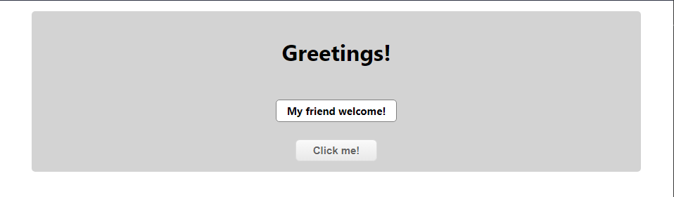

# Greetings! (Front End)

>  Simple Rails + React app where we display greetings messages using a API created on Rails and frontend using React

## Main Page



### Built using
    - Github
    - RubyMine
    - CSS3
    - React
    - Redux

## Getting Started

To get a local copy up and running follow these simple example steps.

## Prerequisites

* Make sure that **Node JS** is installed in your computer.

* [Download](https://github.com/kensayo/captsonetheaterreservation-frontend/archive/refs/heads/development.zip) and unzip **or** [clone this repository](https://docs.github.com/es/github/creating-cloning-and-archiving-repositories/cloning-a-repository)

* You also need the back end server, you can find it [here](https://github.com/kensayo/hello-rails-back-end)


## Setup

- After clone or download the repository move to the root of the proyect
- Open a terminal there and run the next commands
```
// Install dependecies
npm install
// Start the server
npm start
```

## Usage

- Just go to [http://localhost:3000/](http://localhost:3000/)


## 👤 Kenny Ortega

- GitHub: [kensayo](https://github.com/kensayo)
- Twitter: [@kensayo](https://twitter.com/kensayo)
- LinkedIn: [LinkedIn](https://www.linkedin.com/in/kennyortega/)


## Contributions and issues are welcome!

